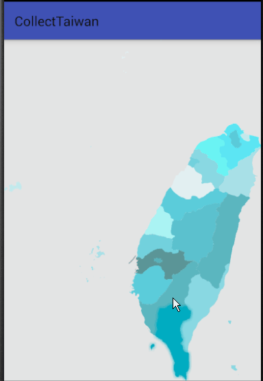

# SVG自定义控件

* 不规则区域点击判断Region

---

    public boolean isTouch(float x, float y) {
        RectF rectF = new RectF();
        path.computeBounds(rectF, true);
        Region region = new Region();
        region.setPath(path, new Region((int) rectF.left, (int) rectF.top, (int) rectF.right, (int) rectF.bottom));
        return region.contains((int) x, (int) y);
    }

---

* SVG解析出path集合
    
    [使用工具类](https://github.com/halohoop/Halohoop_Code_Schools_New/blob/android_templete_solutions/Android/android_templete_solutions/Class.md#007path%E8%A7%A3%E6%9E%90%E5%B7%A5%E5%85%B7%E7%B1%BBpathparserjava)

---
    /**
     * @param inputStream svg xml 的 文件流
     * @param container   结果的容器
     * @param clz bean的class对象
     */
    public static <T> void pathParseFromSVGInputStream(InputStream inputStream,
                                                       List<T> container, Class<T> clz) {
        DocumentBuilderFactory factory = DocumentBuilderFactory.newInstance();
        try {
            DocumentBuilder documentBuilder = factory.newDocumentBuilder();
            Document parse = documentBuilder.parse(inputStream);
            Element documentElement = parse.getDocumentElement();
            NodeList paths = documentElement.getElementsByTagName("path");
            Method setId = clz.getDeclaredMethod("setId", String.class);
            Method setTitle = clz.getDeclaredMethod("setTitle", String.class);
            Method setPath = clz.getDeclaredMethod("setPath", Path.class);
            Method setColor0 = clz.getDeclaredMethod("setColor0", int.class);
            Method setColor1 = clz.getDeclaredMethod("setColor1", int.class);
            for (int i = 0; i < paths.getLength(); i++) {
                Element item = (Element) paths.item(i);
                String id = item.getAttribute("id");
                String title = item.getAttribute("title");
                String pathData = item.getAttribute("d");
                Path path = createPathFromPathData(pathData);
                T t = (T) clz.newInstance();
                setId.invoke(t, id);
                setTitle.invoke(t, title);
                setPath.invoke(t, path);
                setColor0.invoke(t, Colors.COLORS0[i % Colors.COLORS0.length]);
                setColor1.invoke(t, Colors.COLORS1[i % Colors.COLORS1.length]);
                container.add(t);
            }
        } catch (Exception e) {
            e.printStackTrace();
        }
    }

---

## License

    Copyright 2017, Halohoop

    Licensed under the Apache License, Version 2.0 (the "License");
    you may not use this file except in compliance with the License.
    You may obtain a copy of the License at

       http://www.apache.org/licenses/LICENSE-2.0

    Unless required by applicable law or agreed to in writing, software
    distributed under the License is distributed on an "AS IS" BASIS,
    WITHOUT WARRANTIES OR CONDITIONS OF ANY KIND, either express or implied.
    See the License for the specific language governing permissions and
    limitations under the License.